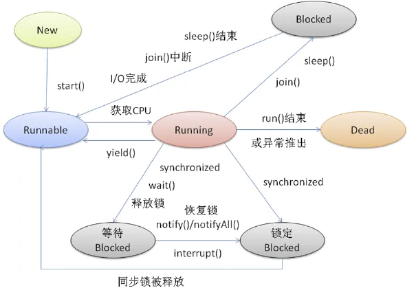
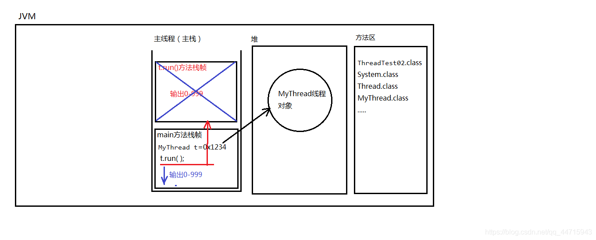
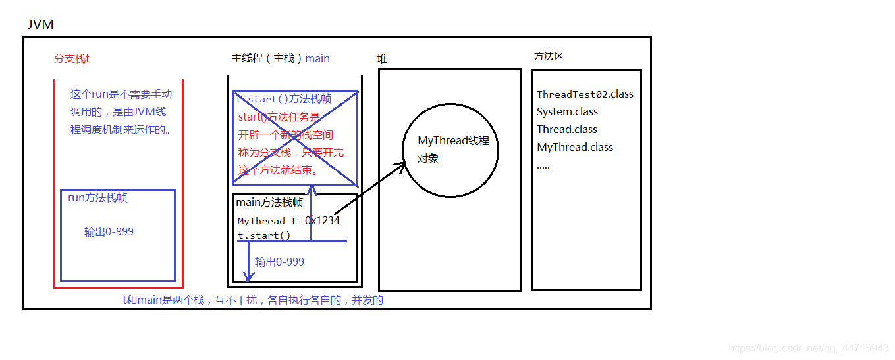

# 线程状态


# 实现线程方式
## 1.继承java.lang.Thread 重写run方法

* **t.run()**  不会启动线程，只是普通的调用方法而已。不会分配新的分支栈。（这种方式就是单线程。）
* **t.start()**  方法的作用是：启动一个分支线程，在JVM中开辟一个新的栈空间，这段代码任务完成之后，瞬间就结束了。
  这段代码的任务只是为了开启一个新的栈空间，只要新的栈空间开出来，start()方法就结束了。线程就启动成功了。
  启动成功的线程会自动调用run方法，并且run方法在分支栈的栈底部（压栈）。
  run方法在分支栈的栈底部，main方法在主栈的栈底部。run和main是**平级**的。

**调用run()方法内存图：**

**调用start()方法内存图：**


以下是一个继承 Thread 类创建线程的示例：

```Java
public class MyThread extends Thread {

    @Override
    public void run() {
        // 在 run() 方法中编写线程要执行的任务。
        System.out.println("Hello, world!");
    }

}
```

要启动 MyThread 线程，可以使用以下代码：

```Java
MyThread myThread = new MyThread();
myThread.start();
```

当 MyThread 线程启动后，它将执行 run() 方法中的代码，并在控制台上输出 "Hello, world!"

## 2.实现java.lang.Runnable接口 实现run方法

1. 怎么创建线程对象？ **new**线程类传入可运行的类/接口。
2. 怎么启动线程呢？ 调用线程对象的 **`start()`**  方法。

```Java
public class ThreadTest03 {
    public static void main(String[] args) {
        Thread t = new Thread(new MyRunnable()); 
        // 启动线程
        t.start();
    
        for(int i = 0; i < 100; i++){
            System.out.println("主线程--->" + i);
        }
    }
}

// 这并不是一个线程类，是一个可运行的类。它还不是一个线程。
class MyRunnable implements Runnable {
    @Override
    public void run() {
        for(int i = 0; i < 100; i++){
            System.out.println("分支线程--->" + i);
        }
    }
}
```

**第二种方式**实现接口比较常用，因为一个类实现了接口，它还可以去继承其它的类，更灵活。
## 3.**使用Callable和Future**

Callable 和 Future 接口用于异步执行任务。Callable 接口用于创建可以返回结果的任务，Future 接口用于获取任务的结果。

Callable 接口的实现类必须实现 call() 方法，call() 方法用于执行任务并返回结果。Future 接口的实现类必须实现 get() 方法，get() 方法用于获取任务的结果。

Callable 和 Future 接口通常用于与线程池一起使用。线程池可以用于管理多个线程，并可以将任务提交给线程池以执行。当任务执行完成后，线程池会返回 Future 对象，Future 对象可以用于获取任务的结果。

以下是一个使用 Callable 和 Future 接口的示例：

```Java
ExecutorService executorService = Executors.newFixedThreadPool(10);

// 创建 Callable 对象
Callable<Integer> callable = new Callable<Integer>() {

    @Override
    public Integer call() throws Exception {
        // 执行任务
        System.out.println("任务正在执行...");
        Thread.sleep(1000);
        return 100;
    }

};

// 将任务提交给线程池
Future<Integer> future = executorService.submit(callable);

// 获取任务的结果
try {
    Integer result = future.get();
    System.out.println("任务执行完成，结果为：" + result);
} catch (InterruptedException | ExecutionException e) {
    e.printStackTrace();
}

// 关闭线程池
executorService.shutdown();
```

当程序执行完毕后，控制台将输出以下内容：

> 任务正在执行...
> 任务执行完成，结果为：100

不用线程池实现的例子：

```Java
Callable<Integer> callable = new Callable<Integer>() {
   public Integer call() throws Exception {
      // 线程的执行逻辑
      System.out.println("线程执行逻辑");
      return 100;
   }
};

FutureTask<Integer> futureTask = new FutureTask<>(callable);
//因为future也是实现了runnable接口的
Thread thread = new Thread(futureTask);
thread.start();

try {
   Integer result = futureTask.get();
   System.out.println("任务执行完成，结果为：" + result);
} catch (InterruptedException | ExecutionException e) {
   e.printStackTrace();
}
```

Callable 接口提供了一个 call() 方法，用于执行任务并返回结果。FutureTask 类是 Future 和 Runnable 接口的实现类，它保存着 call() 方法和实现了 Runnable 的 run() 方法，还有线程的状态和返回值变量，在调用run()方法的时候会执行call()。

当调用 FutureTask.get() 方法时，FutureTask 会先判断线程是否执行完成。如果线程已经执行完成，则 FutureTask 会返回线程的返回值。如果线程还没有执行完成，则 FutureTask 会调用 park() 方法使当前线程阻塞，直到线程执行完成后被唤醒。

## 4.**使用Lambda表达式**

在Java 8及更高版本中，可以使用Lambda表达式来简化线程的创建和执行。通过将逻辑代码封装在Lambda表达式中，你可以更加简洁地创建线程。让我们看看下面的示例：

```Java
Thread thread = new Thread(() -> {
    // 线程的执行逻辑
    System.out.println("线程执行逻辑");
});

// 启动线程
thread.start();
```

### 5.使用线程池

使用Executor框架可以更方便地管理和调度线程。通过使用ExecutorService接口的实现类（如ThreadPoolExecutor），可以创建线程池，并将任务提交给线程池来执行。让我们看看下面的示例：

```Java
ExecutorService executor = Executors.newFixedThreadPool(5);

// 创建Runnable对象
Runnable runnable = () -> {
    // 线程的执行逻辑
    System.out.println("线程执行逻辑");
};

// 提交任务给线程池
executor.submit(runnable);

// 关闭线程池
executor.shutdown();
```

# 线程池

## 什么是线程池？

线程池是一种利用池化技术思想来实现的线程管理技术

> 类似的利用池化思想的技术还有MySQL的**连接池**，JVM的**字符串常量池**，Netty的**基于池化技术的ByteBuff**

主要是为了复用线程、便利地管理线程和任务、并将线程的创建和任务的执行解耦开来。

我们可以创建线程池来复用已经创建的线程来降低频繁创建和销毁线程所带来的资源消耗。

在Java中主要是使用ThreadPoolExecutor类来创建线程池

JDK中也提供了Executors工厂类来创建线程池（不推荐使用）。

## 为什么用它

优点：

1. 降低资源消耗，复用已创建的线程来降低创建和销毁线程的消耗。
2. 提高响应速度，任务到达时，可以不需要等待线程的创建立即执行。
3. 提高线程的可管理性，使用线程池能够统一的分配、调优和监控。

## 线程池的使用场景有哪些
1. 快速响应用户请求，响应速度优先。比如一个用户请求，需要通过 RPC 调用好几个服务去获取数据然后聚合返回，此场景就可以用线程池并行调用，响应时间取决于响应最慢的那个 RPC 接口的耗时；又或者一个注册请求，注册完之后要发送短信、邮件通知，为了快速返回给用户，可以将该通知操作丢到线程池里异步去执行，然后直接返回客户端成功，提高用户体验。

2. 单位时间处理更多请求，吞吐量优先。比如接受 MQ 消息，然后去调用第三方接口查询数据，此场景并不追求快速响应，主要利用有限的资源在单位时间内尽可能多的处理任务，可以利用队列进行任务的缓冲。


## 概述

Java中线程池的核心实现类是ThreadPoolExecutor，可以通过该类地构造方法来构造一个线程池，我们先来看下ThreadPoolExecutor的整个继承体系

Executor接口提供了将任务的执行和线程的创建以及使用解耦开来的抽象
ExecutorService接口继承了Executor接口，在Executor的基础上，增加了一些关于管理线程池本身的一些方法，比如查看任务的状态、stop/terminal线程池、获取线程池的状态等等。

### **ThreadPoolExecutor的构造组成**

1. **任务队列（Task Queue）** ：用于存储待执行的任务。线程池中的线程会从任务队列中取出任务并执行。
2. **核心线程数（Core Pool Size）** ：线程池中始终保持的最小线程数，即使它们是空闲的。
3. **最大线程数（Maximum Pool Size）** ：线程池中允许的最大线程数。当任务队列已满，且核心线程都在执行任务时，线程池会创建新的线程，直到达到最大线程数。
4. **线程存活时间（Thread Keep-Alive Time）** ：当线程池中的线程空闲一段时间后，它们会被回收，以减少资源占用。
5. UNIT：线程池维护允许的空闲时间的单位
6. ThreadFactory：生成线程池工作线程的线程工厂，一般使用默认
7. **任务拒绝策略（Task Rejection Policy）** ：当任务队列已满，并且线程池中的线程达到最大数时，新任务会被拒绝执行。任务拒绝策略定义了如何处理这些被拒绝的任务。

```Java
public ThreadPoolExecutor(int corePoolSize,
                          int maximumPoolSize,
                          long keepAliveTime,
                          TimeUnit unit,
                          BlockingQueue<Runnable> workQueue,
                          ThreadFactory threadFactory,
                          RejectedExecutionHandler handler) 
```

### 核心线程数

核心线程数表示线程池中始终保持的最小线程数。在许多情况下，核心线程数的设置应该根据应用程序的性质和硬件配置来确定。以下是一些核心线程数设置的建议：

* **CPU 密集型任务(N+1)：**  这种任务消耗的主要是 CPU 资源，可以将线程数设置为 N（CPU 核心数）+1。比 CPU 核心数多出来的一个线程是为了防止线程偶发的缺页中断，或者其它原因导致的任务暂停而带来的影响。一旦任务暂停，CPU 就会处于空闲状态，而在这种情况下多出来的一个线程就可以充分利用 CPU 的空闲时间。
* **I/O 密集型任务：**  这种任务应用起来，系统会用大部分的时间来处理 I/O 交互，而线程在处理 I/O 的时间段内不会占用 CPU 来处理，这时就可以将 CPU 交出给其它线程使用。因此在 I/O 密集型任务的应用中，我们可以多配置一些线程，具体的计算方法是：
> 最佳线程数目 = （（线程等待时间+线程CPU时间）/线程CPU时间 ）* CPU数目


* **混合型任务**：如果应用程序同时执行CPU密集型和IO密集型任务，核心线程数的设置需要综合考虑。通常可以根据具体情况来调整核心线程数。

### **最大线程数**

最大线程数表示线程池中允许的最大线程数。设置最大线程数的目的是控制线程池的最大并发度，以防止创建过多线程导致系统资源不足。以下是一些最大线程数设置的建议：

* **资源受限的系统**：如果应用程序运行在资源受限的环境中，比如嵌入式系统或云服务器，通常需要限制最大线程数，以免过多线程占用资源。在这种情况下，最大线程数可以设置得相对较小。
* **高并发系统**：对于需要处理大量并发请求的系统，可以适当增加最大线程数，以提高系统的并发处理能力

### **任务队列/阻塞队列**

任务队列大小表示线程池任务队列可以容纳的最大任务数。任务队列在核心线程都繁忙的情况下，用于存储等待执行的任务。任务队列的大小应根据系统的负载情况来设置：

* **高并发系统**：对于高并发系统，可以考虑将任务队列设置得较大，以容纳更多等待执行的任务，从而降低任务被拒绝执行的概率。
* **资源受限的系统**：在资源受限的系统中，任务队列大小可能需要设置得相对较小，以控制内存消耗。

不同的线程池会选用不同的阻塞队列，我们可以结合内置线程池来分析。

* 容量为 `Integer.MAX_VALUE` 的 `LinkedBlockingQueue`（无界队列）：`FixedThreadPool` 和 `SingleThreadExector` 。`FixedThreadPool`最多只能创建核心线程数的线程（核心线程数和最大线程数相等），`SingleThreadExector`只能创建一个线程（核心线程数和最大线程数都是 1），二者的任务队列永远不会被放满。
* `SynchronousQueue`（同步队列）：`CachedThreadPool` 。`SynchronousQueue` 没有容量，不存储元素，目的是保证对于提交的任务，如果有空闲线程，则使用空闲线程来处理；否则新建一个线程来处理任务。也就是说，`CachedThreadPool` 的最大线程数是 `Integer.MAX_VALUE` ，可以理解为线程数是可以无限扩展的，可能会创建大量线程，从而导致 OOM。
* `DelayedWorkQueue`（延迟阻塞队列）：`ScheduledThreadPool` 和 `SingleThreadScheduledExecutor` 。`DelayedWorkQueue` 的内部元素并不是按照放入的时间排序，而是会按照延迟的时间长短对任务进行排序，内部采用的是“堆”的数据结构，可以保证每次出队的任务都是当前队列中执行时间最靠前的。`DelayedWorkQueue` 添加元素满了之后会自动扩容原来容量的 1/2，即永远不会阻塞，最大扩容可达 `Integer.MAX_VALUE`，所以最多只能创建核心线程数的线程。

### 拒绝策略

当线程池的任务队列已满，并且线程池中的线程数目达到maximumPoolSize时，如果还有任务到来就会采取任务拒绝策略，通常有以下四种策略

1. AbortPolicy
    丢弃任务，并抛出一个类型为 RejectedExecutionException的RuntimeException，让你感知到任务被拒绝了，于是你便可以根据业务逻辑选择重试或者放弃提交等策略。
2. DiscardPolicy
    这种拒绝策略正如它的名字所描述的一样，当新任务被提交后直接被丢弃掉，也不会给你任何的通知，相对而言存在一定的风险，因为我们提交的时候根本不知道这个任务会被丢弃，可能造成数据丢失。
3. DiscardOldestPolicy
    如果线程池没被关闭且没有能力执行，则会丢弃任务队列中的头结点，通常是存活时间最长的任务，这种策略与第二种不同之处在于它丢弃的不是最新提交的，而是队列中存活时间最长的，这样就可以腾出空间给新提交的任务，但同理它也存在一定的数据丢失风险。
4. CallerRunsPolicy
    当有新任务提交后，如果线程池没被关闭且没有能力执行，则把这个任务交于提交任务的线程执行，也就是谁提交任务，谁就负责执行任务。这样做主要有两点好处。
    第一点新提交的任务不会被丢弃，这样也就不会造成业务损失。
    第二点好处是，由于谁提交任务谁就要负责执行任务，这样提交任务的线程就得负责执行任务，而执行任务又是比较耗时的，在这段期间，提交任务的线程被占用，也就不会再提交新的任务，减缓了任务提交的速度，相当于是一个负反馈。在此期间，线程池中的线程也可以充分利用这段时间来执行掉一部分任务，腾出一定的空间，相当于是给了线程池一定的缓冲期。
