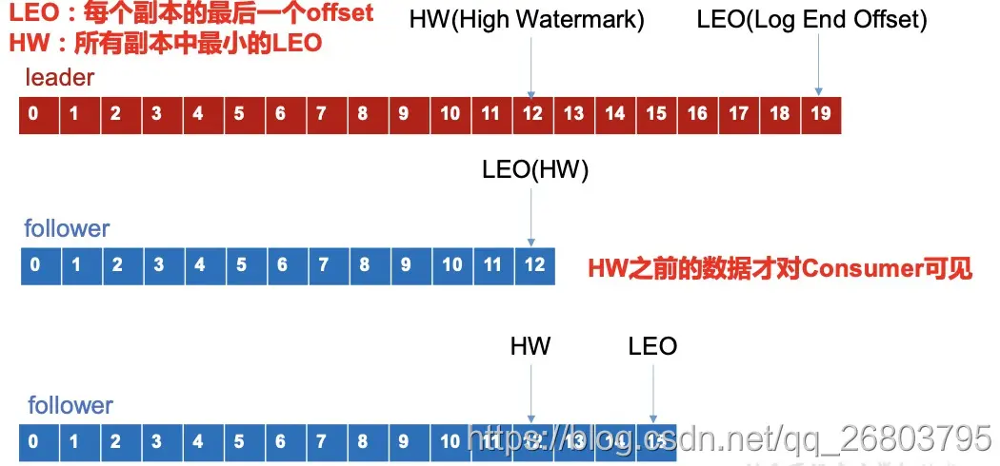

# 如何保证数据可靠性和数据一致性

当我们讨论**可靠性**的时候，我们总会提到**保证**这个词语。可靠性保证是基础，我们基于这些基础之上构建我们的应用。比如关系型数据库的可靠性保证是ACID，也就是原子性（Atomicity）、一致性（Consistency）、隔离性（Isolation）和持久性（Durability）。

Kafka 中的可靠性保证有如下四点：

* 对于一个分区来说，它的消息是有序的。如果一个生产者向一个分区先写入消息A，然后写入消息B，那么消费者会先读取消息A再读取消息B。
* 当消息写入所有in-sync状态的副本后，消息才会认为**已提交（committed）** 。这里的写入有可能只是写入到文件系统的缓存，不一定刷新到磁盘。生产者可以等待不同时机的确认，比如等待分区主副本写入即返回，后者等待所有in-sync状态副本写入才返回。
* 一旦消息已提交，那么只要有一个副本存活，数据不会丢失。
* 消费者只能读取到已提交的消息。

使用这些基础保证，我们构建一个可靠的系统，这时候需要考虑一个问题：究竟我们的应用需要多大程度的可靠性？可靠性不是无偿的，它与系统可用性、吞吐量、延迟和硬件价格息息相关，得此失彼。因此，我们往往需要做权衡，一味的追求可靠性并不实际。

## 分布式主从结构怎么做数据同步

分布式系统处理故障容错时，需要明确地定义节点是否处于存活状态。Kafka对节点的存活定义有两个条件：

1. 节点必须和ZK保持会话
2. 如果这个节点是某个分区的备份副本，它必须对分区主副本的写操作进行复制，并且复制的进度不能落后太多

满足这两个条件，叫作“正在同步中”（in-sync）。每个分区的主副本会跟踪正在同步中的备份副本节点（In Sync Replicas，即ISR）。如果一个备份副本挂掉、没有响应或者落后太多，主副本就会将其从同步副本集合中移除。反之，如果备份副本重新赶上主副本，它就会加入到主副本的同步集合中。

在Kafka中，一条消息只有被ISR集合的所有副本都运用到本地的日志文件，才会认为消息被成功提交了。任何时刻，只要ISR至少有一个副本是存活的，Kafka就可以保证“一条消息一旦被提交，就不会丢失”。只有已经提交的消息才能被消费者消费，因此消费者不用担心会看到因为主副本失败而丢失的消息。下面我们举例分析Kafka的消息提交机制如何保证消费者看到的数据是一致的。

### ISR

首先，ISR 的全称叫做：In-Sync Replicas （同步副本集）, 我们可以理解为和 leader 保持同步的所有副本的集合。

一个分区的所有副本集合叫做 AR（ Assigned Repllicas ） ，与 leader-replica 未能保持同步的副本集叫做 OSR（ Out-Sync Relipcas ）。

因此我们就能得到这么一个表示：AR = ISR + OSR，翻译一下就是一个分区的副本集分为同步集合和非同步集合两部分。

那么我们可以假设一个场景，一个分区的 AR 集合为【0,1,2,3,4,5】，其中 leader-replica 是 0，其中【1,2,3】作为 follower 和 leader 的数据保持同步，而【4,5】未能和 leader 保持同步。

那么此时，ISR=【0,1,2,3】，OSR=【4,5】

如果此时副本 4 追上了 leader-replica，也就是和 leader 保持到了同步 那么此时，ISR=【0,1,2,3,4】，OSR=【5】

从上面的场景我们就可以明白，ISR 动态维护了一个和 leader 副本保持同步副本集合，ISR 中的副本全部都和 leader 的数据保持同步

### ACK应答机制
由于数据的重要程度是不一样的，有些可以少量允许丢失，希望快一点处理；有些不允许，希望稳妥一点处理，所以没必要所有的数据处理的时候都等ISR中的follower全部接收成功。因此kafka处理数据时为了更加灵活，给用户提供了三种可靠性级别，用户可以通过调节acks参数来选择合适的可靠性和延迟。

acks的参数分别可以配置为：0，1，-1。

它们的作用分别是：

- 配置为0：producer不等待broker的ack，这一操作提供了一个最低的延迟，broker一接收到还没有写入磁盘就已经返回，当broker故障时有可能丢失数据；
- 配置为1：producer等待broker的ack，partition的leader写入磁盘成功后返回ack，但是如果在follower同步成功之前leader故障，那么将会丢失数据；
- 配置为-1：producer等待broker的ack，partition的leader和follower全部写入磁盘成功后才返回ack。但是如果在follower同步完成后，broker发送ack之前，leader发生故障，此时会选举新的leader，但是新的leader已经有了数据，但是由于没有之前的ack，producer会再次发送数据，那么就会造成数据重复。

## 故障处理
- LEO：全称Log End Offset，代表每个副本的最后一条消息的offset
- HW：全称High Watermark，代表一个分区中所有副本最小的LEO，用来判定副本的备份进度，HW以外的消息不被消费者可见。

leader持有的HW即为分区的HW，同时leader所在broker还保存了所有follower副本的LEO。

注意：**只有HW之前的数据才对Consumer可见，也就是只有同一个分区下所有的副本都备份完成，才会让Consumer消费。**

由于partition是实际的存储数据的结构，因此kafka的故障主要分为两类：follower故障和leader故障。

### follower故障
通过前面我们已经知道follower发生故障后会被临时踢出ISR，其实待该follower恢复后，follower会读取本地磁盘记录的上次的HW，并将log文件高于HW的部分截取掉，从HW开始向leader进行同步。等该follower的LEO大于等于该分区的HW（leader的HW），即follower追上leader之后（追上不代表相等），就可以重新加入ISR了。

### Leader故障
leader发生故障之后，会从ISR中选出一个新的leader，之后，为保证多个副本之间的数据一致性，其余的follower会先将各自的log文件高于HW的部分截掉，然后从新的leader同步数据。

**这只能保证副本之间的数据一致性，并不能保证数据不丢失或者不重复。**

那怎么解决故障恢复后，数据丢失和重复的问题呢？

kafka在0.11版本引入了Lead Epoch来解决HW进行数据恢复时可能存在的数据丢失和重复的问题：

leader epoch实际是一对值（epoch, offset），epoch表示leader版本号，offset为对应版本leader的LEO，它在Leader Broker上单独开辟了一组缓存，来记录(epoch, offset)这组键值对数据，这个键值对会被定期写入一个检查点文件。Leader每发生一次变更epoch的值就会加1，offset就代表该epoch版本的Leader写入的第一条日志的位移。当Leader首次写底层日志时，会在缓存中增加一个条目，否则不做更新。这样就解决了之前版本使用HW进行数据恢复时可能存在的数据丢失和重复的问题